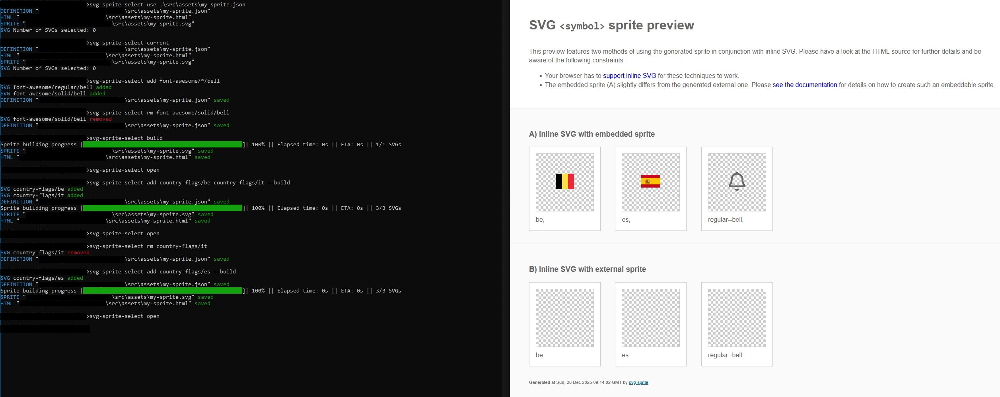

# SVG Sprite Select

A CLI tool to manage a single SVG sprite at a time using a JSON definition file.

## Why?
Some web applications load icons dynamically and cannot rely on a static, full icon sprite without shipping unused assets.
This tool solves that problem by letting you define, and rebuild, a sprite that contains only the icons your application actually needs.

## Features
- Avoid repeating sprite build logic across projects.
- Keep sprite definitions in a JSON file.
- Manage sprite content via a simple CLI.

## Installation
Clone and install dependencies:

```bash
git clone <repo-url>
pnpm install
```

You can run the CLI locally:

```bash
./bin/svg-sprite-select.js <command>
```

## CLI commands (examples)
- Add icons:
```bash
svg-sprite-select add country-flags/be
svg-sprite-select add font-awesome/solid/acorn font-awesome/solid/acorn
svg-sprite-select add font-awesome/solid/*
```
- Remove icons:
```bash
svg-sprite-select rm country-flags/be
svg-sprite-select rm font-awesome/solid/*
```
- Build the sprite:
```bash
svg-sprite-select build
```
- Set/unset the sprite output path:
```bash
svg-sprite-select sprite ./font-awesome.svg
svg-sprite-select sprite ""
```
- Set/unset the HTML example path:
```bash
svg-sprite-select html ./font-awesome.html
svg-sprite-select html ""
```
- Switch definition file:
```bash
svg-sprite-select use ./font-awesome.json
```
- Other:
```bash
svg-sprite-select clear     # clear current definition
svg-sprite-select current   # print current definition
svg-sprite-select open      # open the sprite
```

## Configuration
Sprite definitions are stored as JSON. Use paths relative to your project root to avoid surprises when teammates run the CLI.

## Git
Add generated artifacts to `.gitignore`:

```
.svg-sprite-select/
```

## Example


---
